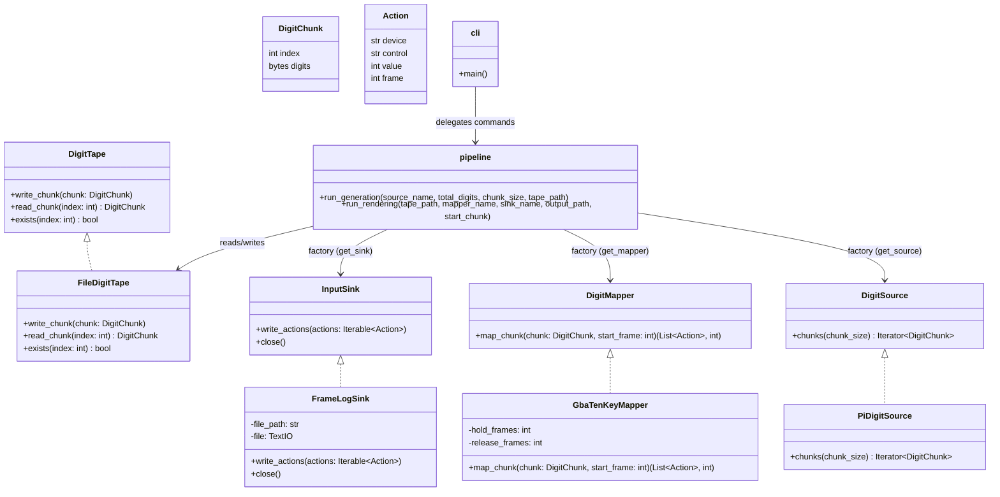

# DigPipe Class Diagram

**Notes**

- Chunk indices are zero-based. `run_rendering(..., start_chunk=n)` begins with `chunk_nnnnnn.dgt`.
- `PiDigitSource` includes the leading `3` when counting digits (e.g., `--digits 5` yields `31415`). Guard digits are internal and never emitted.
- `FileDigitTape` enforces even-length chunks and digit values `0–9`; invalid inputs raise `ValueError`.
